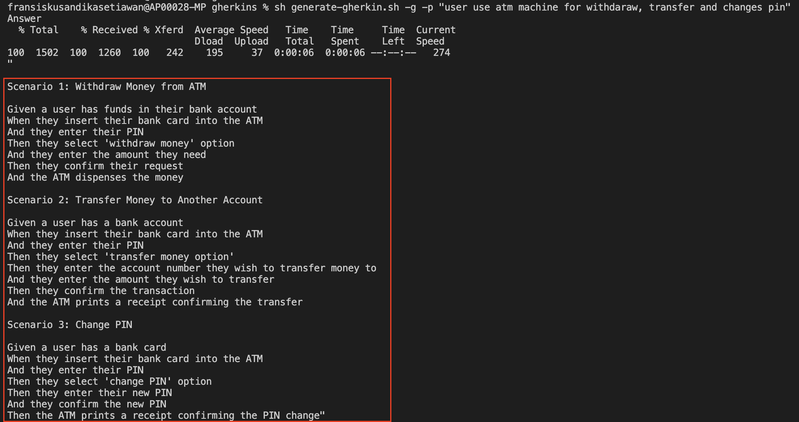

# Generate gherkin scenario using chatGPT
Just prepare your requirements, your chatGPT can translate your requirements to gherkin scenario.

## Installation
Install jq

#### MAC
Use [Homebrew](http://brew.sh/) to install jq.
```bash
brew install jq
```

#### WINDOWS
Use [Chocolatey NuGet](https://chocolatey.org/) to install jq.
```bash
chocolatey install jq
```

#### LINUX
```bash
sudo apt-get install jq
```

## Usage
Register chatGPT and [Generate chatGPT APIKEY](https://beta.openai.com/account/api-keys)
and put your APIKEY to .env file

```bash
mv .env_sample .env

#Generate gherkin scenario
sh generate-gherkin.sh -g -p "YOUR REQUIREMENTS"
```

## Contributing

Pull requests are welcome. For major changes, please open an issue first
to discuss what you would like to change.

Please make sure to update tests as appropriate.

## Example


